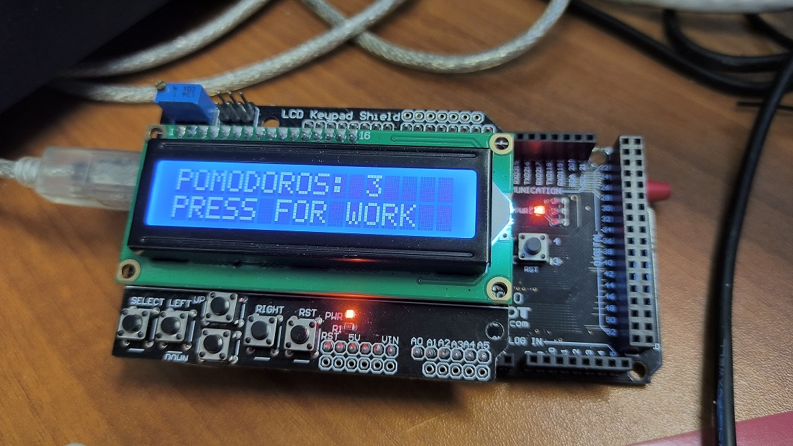

# Помидорка на Arduino+LCD

Сборка под декстоп для теста и под целевую плфтформу



После клонирования обновить сабмодуль:
```
git clone git@github.com:antlas1/ardupomodoro.git
cd ardupomodoro
git submodule init
git submodule update
```

Для сборки используется среда Arduino(1.8.1), mingw (из комплекта Qt) и visual studio 2022 под десктоп.
см. каталог `scripts`.

TODO...
* Описание конфигурация для сборки под arduino
* Выбор плат есть в сконфигурированном файле build_arduino/BoardOptions.cmake
* Сначала загрузить простые примерчики черех IDE, чтобы убиться, что настройки правильные
